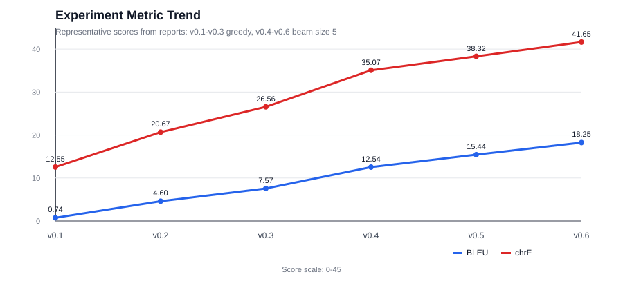

# seq2seq-transformer

한국어 문장을 영어 문장으로 번역하는 seq2seq Transformer 실험 프로젝트입니다. 사전학습 번역 모델을 사용하지 않고, SentencePiece 토크나이저와 PyTorch `nn.Transformer` 기반 인코더-디코더 모델을 from scratch로 학습해본 실험 레포입니다.

## 1. 프로젝트 개요

### 1.1 주요 기능

- `src/data_pipeline.py`: Hugging Face `datasets` 기반 한영 병렬 데이터 로딩
- `src/data_pipeline.py`: 한국어와 영어 SentencePiece 토크나이저 학습, 메모리 사전 토크나이징, DataLoader 구성
- `src/transformer_model.py`: PyTorch `nn.Transformer` 기반 seq2seq 모델 구현
- `src/train.py`: teacher forcing 학습 루프, linear warmup/decay LR scheduler, early stopping 구성
- `src/train.py`, `src/model_utils.py`: 검증 손실 기준으로 `best.pt` 체크포인트를 저장하고 평가/번역 시 기본 로드
- `src/transformer_model.py`, `src/translate.py`, `src/evaluate.py`: greedy decoding과 beam search decoding을 옵션으로 지원
- `src/metrics.py`, `src/evaluate.py`: BLEU와 chrF로 번역 품질을 평가
- `src/main.py`, `src/wandb_experiment.py`: CLI, Jupyter Notebook, W&B 실험 실행을 지원

### 1.2 프로젝트 구조

```text
seq2seq-transformer/
├── src/
│   ├── config.py              # 데이터셋, 토크나이저, 모델, 학습 설정
│   ├── data_pipeline.py       # 데이터 로딩, 분할, 토큰화, DataLoader 구성
│   ├── transformer_model.py   # seq2seq Transformer 모델
│   ├── model_utils.py         # 모델, 토크나이저, 체크포인트 유틸리티
│   ├── train.py               # 학습 루프, LR scheduler, early stopping, 체크포인트 저장 로직
│   ├── evaluate.py            # 평가와 예측 생성 로직
│   ├── translate.py           # 단일 문장 번역 로직
│   ├── metrics.py             # BLEU와 chrF 계산 로직
│   ├── main.py                # CLI 진입점
│   └── wandb_experiment.py    # W&B 학습 및 평가 실행 스크립트
├── notebooks/
│   ├── 01_sentencepiece_tokenizer.ipynb
│   ├── 02_train_model.ipynb
│   ├── 03_evaluate_model.ipynb
│   └── 04_train_and_evaluate_wandb.ipynb
├── data/                      # SentencePiece 모델과 vocab 파일
├── reports/                   # 평가 리포트와 이미지
├── checkpoints/               # 학습 시 생성되는 모델 체크포인트 경로
├── pyproject.toml
├── .env.example
└── README.md
```

## 2. 실험 결과

### 2.1 결과 요약

초기 v0.1 실험은 20,000개 학습 데이터와 3.74M parameter Transformer 기준이며, 이후 데이터 규모, 학습 step, 모델 깊이/폭, LR scheduler, beam search 평가를 단계적으로 확장한 구성입니다. v0.6은 500,000개 학습 데이터, `d_model=256`, `nhead=8`, 10.11M parameter 모델을 사용하며, beam search 기준 BLEU `18.2498`, chrF `41.6462`를 기록합니다.

아래 표의 대표 점수는 각 실험 보고서의 주요 평가 결과 기준입니다. v0.1~v0.3은 greedy decoding 결과이며, v0.4~v0.6은 greedy와 beam search 중 더 높은 점수인 beam size 5 결과입니다.

| 실험 | 주요 변경 사항 | Decode | BLEU | v0.1 대비 BLEU 증가 | chrF | v0.1 대비 chrF 증가 |
|---|---|---|---:|---:|---:|---:|
| v0.1 | 20K train, 10 epoch, 3.74M params baseline | Greedy | 0.7415 | - | 12.5541 | - |
| v0.2 | 100K train, 20 epoch, batch size 64 | Greedy | 4.6000 | +3.8585 | 20.6694 | +8.1153 |
| v0.3 | 200K train, batch size 32, 약 100K update steps | Greedy | 7.5670 | +6.8255 | 26.5584 | +14.0043 |
| v0.4 | 3 encoder/decoder layers, FFN 512, 40 epoch | Beam 5 | 12.5352 | +11.7937 | 35.0741 | +22.5200 |
| v0.5 | 500K train, 60 epoch, LR scheduler, pretokenization | Beam 5 | 15.4420 | +14.7005 | 38.3198 | +25.7657 |
| v0.6 | `d_model=256`, `nhead=8`, 10.11M params, min LR 유지 | Beam 5 | 18.2498 | +17.5083 | 41.6462 | +29.0921 |



첫 실험과 최종 실험을 비교하면 BLEU는 `0.7415 -> 18.2498`로 `+17.5083`, chrF는 `12.5541 -> 41.6462`로 `+29.0921` 증가합니다. 다만 샘플 번역에서는 의미 반전, 정보 누락, 반복 생성이 아직 남아 있어, 다음 단계의 우선순위는 pretrained seq2seq 모델 fine-tuning과 decoding 제약 적용입니다.

### 2.2 실험 리포트

상세 학습 설정, loss 변화, 샘플 번역 평가는 `reports/` 아래의 버전별 리포트를 기준으로 관리합니다.

```text
reports/260624_model_evaluation_v0.1.md
reports/260624_model_evaluation_v0.2.md
reports/260626_model_evaluation_v0.3.md
reports/260626_model_evaluation_v0.4.md
reports/260629_model_evaluation_v0.5.md
reports/260630_model_evaluation_v0.6.md
```

## 3. 데이터와 설정

### 3.1 데이터셋

기본 데이터셋은 다음과 같습니다.

```text
shihyunlim/aihub-ko-en-everyday-expression
```

데이터 파이프라인은 각 행에 다음 컬럼이 있다고 가정합니다.

- `ko`: 한국어 원문
- `en`: 영어 번역문

데이터셋 이름, 분할 비율, 부분 데이터 크기, 모델 크기, 학습 설정은 `src/config.py`에서 관리합니다.

### 3.2 주요 기본 설정

현재 기본 설정은 v0.6 실험 구성을 반영합니다. 로컬 CPU 또는 메모리가 작은 환경에서는 `train_subset_size`, `num_epochs`, `num_workers`를 낮춰 실행하는 것이 현실적입니다.

```python
d_model = 256
nhead = 8
num_encoder_layers = 3
num_decoder_layers = 3
dim_feedforward = 512
batch_size = 32
num_epochs = 60
lr = 1e-4
use_lr_scheduler = True
lr_scheduler_type = "linear"
warmup_steps = 4000
min_lr_ratio = 0.5
early_stopping_patience = 5
early_stopping_min_delta = 0.001
train_subset_size = 500000
valid_subset_size = 2000
test_subset_size = 2000
pretokenize_dataset = True
num_workers = 8
pin_memory = True
persistent_workers = True
decode_strategy = "greedy"
beam_size = 5
checkpoint_dir = "checkpoints"
sp_model_prefix_src = "data/spm_ko"
sp_model_prefix_tgt = "data/spm_en"
```

### 3.3 환경 변수

프로젝트 루트에 `.env` 파일을 생성합니다.

```env
HF_TOKEN=
WANDB_MODE=online
WANDB_API_KEY=
WANDB_PROJECT=seq2seq-transformer
WANDB_ENTITY=
```

- `HF_TOKEN`: Hugging Face 데이터셋 접근 토큰. 데이터셋 접근 권한이 필요 없는 환경에서는 생략 가능
- `WANDB_MODE`: W&B 실행 모드. 일반적으로 `online`, `offline`, `disabled` 중 하나를 사용
- `WANDB_API_KEY`: `wandb login` 대신 사용할 W&B API key
- `WANDB_PROJECT`: W&B 기본 project 이름
- `WANDB_ENTITY`: W&B team 또는 user entity. 기본 계정을 사용할 경우 비워둘 수 있음

`.env.example` 파일은 환경 변수 템플릿입니다.

## 4. 설치와 실행

### 4.1 설치

Python 3.11 이상을 권장합니다.

```bash
python -m venv .venv
.\.venv\Scripts\activate
pip install ".[notebooks]"
```

CUDA 사용 시 로컬 CUDA 버전에 맞는 PyTorch 빌드가 필요합니다.

### 4.2 CLI 실행

모든 명령은 프로젝트 루트에서 실행합니다.

학습 실행:

```bash
python -m src.main --mode train
```

기본 체크포인트 평가:

```bash
python -m src.main --mode evaluate
```

특정 체크포인트 평가:

```bash
python -m src.main --mode evaluate --checkpoint checkpoints/latest.pt
```

단일 문장 번역:

```bash
python -m src.main --mode translate --text "저는 머신러닝을 좋아합니다."
```

beam search 번역:

```bash
python -m src.main --mode translate --text "저는 머신러닝을 좋아합니다." --decode-strategy beam --beam-size 5
```

### 4.3 W&B 실행

W&B를 통한 학습, 평가, 샘플 번역, 체크포인트 artifact 기록:

```bash
wandb login
python -m src.wandb_experiment --project seq2seq-transformer --run-name baseline
```

로컬 로그만 남길 때는 offline 모드를 사용합니다.

```bash
python -m src.wandb_experiment --offline --run-name baseline
```

### 4.4 노트북 실행 순서

1. `notebooks/01_sentencepiece_tokenizer.ipynb`
   - 데이터셋 로드
   - SentencePiece 토크나이저 학습 또는 로드
   - `data/spm_*` 파일 저장

2. `notebooks/02_train_model.ipynb`
   - 모델 생성
   - 학습 및 검증 루프 실행
   - `checkpoints/latest.pt`와 `checkpoints/best.pt` 저장

3. `notebooks/03_evaluate_model.ipynb`
   - `checkpoints/best.pt` 로드
   - 테스트 분할 평가
   - BLEU와 chrF 계산

4. `notebooks/04_train_and_evaluate_wandb.ipynb`
   - 학습과 평가를 하나의 노트북에서 실행
   - 손실, BLEU, chrF, 샘플 번역, 체크포인트 artifact를 W&B에 기록

## 5. 산출물과 저장 정책

### 5.1 SentencePiece 파일

SentencePiece 파일 생성 경로:

```text
data/spm_ko.model
data/spm_ko.vocab
data/spm_en.model
data/spm_en.vocab
```

### 5.2 체크포인트

모델 체크포인트 생성 경로:

```text
checkpoints/latest.pt
checkpoints/best.pt
```

`latest.pt`는 매 epoch마다 덮어쓰며, `best.pt`는 검증 손실이 `early_stopping_min_delta` 이상 개선될 때 갱신합니다. 평가와 번역은 명시한 체크포인트가 없으면 `best.pt`를 우선 사용하고, 없을 때 `latest.pt`를 사용합니다. 체크포인트에는 모델 가중치, optimizer 상태, scheduler 상태, epoch, 학습 손실, 검증 손실, vocabulary 크기, `HF_TOKEN`을 제외한 설정값을 저장합니다.

### 5.3 Git 관리

- `data/spm_*` 토크나이저 파일은 저장소에 포함
- `checkpoints/`, `.env`, 가상환경, 로그, 캐시 파일은 git에서 제외
