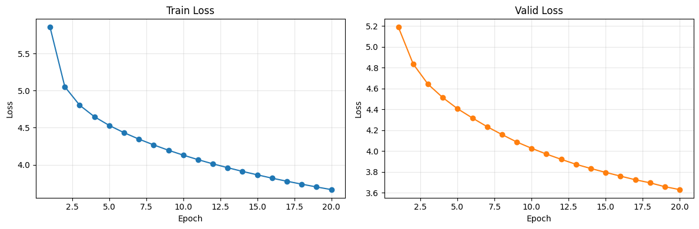

# Model Train and Evaluation: v0.2 실험

## 1. 모델 학습 결과

### 실험 설정 비교

v0.2 실험은 v0.1의 종합 평가에서 제안한 방향 중 학습 데이터 확대, epoch 증가, batch size 증가를 반영한 실험입니다. 다만 v0.1에서 다음 실험 후보로 제안했던 `200,000 / batch 32 / 16 epoch` 설정 대신, 실제 v0.2에서는 `100,000 / batch 64 / 20 epoch` 설정으로 학습했습니다.

| 항목 | v0.1 | v0.2 |
|---|---:|---:|
| Train data size | 20,000 | 100,000 |
| Valid data size | 2,000 | 2,000 |
| Test data size | 2,000 | 2,000 |
| Epochs | 10 | 20 |
| Batch size | 32 | 64 |
| Train batches / epoch | 625 | 1,563 |
| Valid batches | 63 | 32 |
| Test batches | 63 | 32 |
| Learning rate | 0.0001 | 0.0001 |
| Optimizer | Adam | Adam |
| Max sequence length | 128 | 128 |
| Source vocab size | 8,000 | 8,000 |
| Target vocab size | 8,000 | 8,000 |
| Parameters | 3,743,040 | 3,743,040 |
| Approx. update steps | 6,250 | 31,260 |

변경 사항은 다음과 같습니다.

- 학습 데이터는 `20,000 -> 100,000`개로 5배 증가했습니다.
- Epoch는 `10 -> 20`으로 2배 증가했습니다.
- Batch size는 `32 -> 64`로 증가했습니다.
- 모델 구조, vocabulary size, learning rate는 v0.1과 동일하게 유지했습니다.
- 전체 update step은 약 `6.3K -> 31.3K`로 증가했지만, v0.1 종합 평가에서 목표로 언급한 `100K steps`에는 아직 도달하지 못했습니다.

### 학습 Loss

| Epoch | Train loss | Valid loss |
|---:|---:|---:|
| 1 | 5.8568 | 5.1905 |
| 2 | 5.0525 | 4.8365 |
| 3 | 4.8038 | 4.6421 |
| 4 | 4.6478 | 4.5129 |
| 5 | 4.5303 | 4.4057 |
| 6 | 4.4325 | 4.3171 |
| 7 | 4.3462 | 4.2331 |
| 8 | 4.2682 | 4.1577 |
| 9 | 4.1955 | 4.0861 |
| 10 | 4.1299 | 4.0258 |
| 11 | 4.0687 | 3.9701 |
| 12 | 4.0122 | 3.9198 |
| 13 | 3.9605 | 3.8718 |
| 14 | 3.9105 | 3.8317 |
| 15 | 3.8644 | 3.7943 |
| 16 | 3.8189 | 3.7584 |
| 17 | 3.7780 | 3.7237 |
| 18 | 3.7384 | 3.6940 |
| 19 | 3.7005 | 3.6567 |
| 20 | 3.6649 | 3.6289 |

학습 결과는 다음과 같습니다.

- Best validation loss는 epoch 20의 `3.6289`입니다.
- v0.1의 best validation loss `4.7113` 대비 `1.0824` 감소했습니다.
- Train loss와 valid loss가 모든 epoch에서 안정적으로 감소했습니다.
- Validation loss가 마지막 epoch까지 계속 개선되어, 현재 설정에서는 추가 학습 여지가 남아 있을 가능성이 있습니다.

## 2. 모델 평가 결과

### 평가 설정

| 항목 | 값 |
|---|---:|
| Evaluation notebook | `notebooks/03_evaluate_model.ipynb` |
| Checkpoint | `checkpoints/best.pt` |
| Checkpoint epoch | 20 |
| Checkpoint valid loss | 3.6288954690098763 |
| Test data size | 2,000 |
| Test batches | 32 |
| Predictions | 2,000 |
| References | 2,000 |
| Decode strategy | Greedy |
| Max decode length | 128 |

### 정량 평가

| Metric | v0.1 | v0.2 | 변화 |
|---|---:|---:|---:|
| BLEU | 0.7415 | 4.6000 | +3.8585 |
| chrF | 12.5541 | 20.6694 | +8.1153 |
| Best valid loss | 4.7113 | 3.6289 | -1.0824 |

정량 평가 결과는 다음과 같이 해석했습니다.

- v0.2는 v0.1 대비 BLEU와 chrF가 모두 개선되었습니다.
- BLEU는 `0.7415 -> 4.6000`으로 상승해 reference와의 n-gram 일치가 증가했습니다.
- chrF는 `12.5541 -> 20.6694`로 상승해 문자 단위 overlap도 개선되었습니다.
- 그러나 BLEU `4.6000`은 여전히 낮은 점수입니다. 번역 모델로 실사용하기에는 문장 의미 보존과 자연스러움이 부족합니다.
- Validation loss 개선 폭에 비해 BLEU/chrF 개선은 제한적입니다. Loss 감소가 곧바로 충분한 번역 품질로 이어지지는 않았습니다.

### Sample Translation 평가

| No. | Reference | Prediction | 주요 오류 유형 | 코멘트 |
|---:|---|---|---|---|
| 1 | The satin pillow comes in king size, and queen size. | The FFF comes with a new car, and a new car. | 문맥 불일치, 동어 반복 | v0.1보다 문장 형태는 자연스러워졌지만, 베개 사이즈 정보가 자동차 관련 문장으로 잘못 번역되었습니다. |
| 2 | Sorry, but your members are attacking us. | I'm sorry, and we're going to be able to heard. | 어색한 문장, 문맥 불일치 | 사과 표현은 일부 맞았지만 공격받고 있다는 핵심 의미가 사라졌고, `be able to heard`는 비문입니다. |
| 3 | I am a hearty eater. | I like a good idea. | 문맥 불일치 | 문장 자체는 v0.1보다 자연스럽지만 식사량/식성 의미를 반영하지 못했습니다. |
| 4 | Thank you for also sending the prototypes. | Thank you for your reply. | 부분 일치, 문맥 불일치 | 감사 표현은 맞았지만 `prototypes` 발송 의미가 `reply`로 바뀌었습니다. |
| 5 | That is all for now, and thank you for your patience. | Thank you, and thank you for your questions. | 부분 일치, 동어 반복 | 감사 표현은 유지했지만 `patience` 의미가 사라졌고 `thank you`가 반복되었습니다. |
| 6 | Your question has been sent. | I've received your inquiry about the invoice. | 부분 일치, 문맥 불일치 | 문의 관련 표현은 일부 맞았지만, 질문이 발송되었다는 의미가 invoice 문의 수신으로 바뀌었습니다. |
| 7 | OK, we can watch a horror film. | Yes, I like to eat a movie. | 어색한 문장, 문맥 불일치 | `Yes`와 `movie`는 일부 관련이 있지만, `eat a movie`가 비문이며 공포 영화 시청 의미를 전달하지 못했습니다. |
| 8 | I'm not feeling so good. | I don't have any time. | 문맥 불일치 | 자연스러운 영어 문장이지만 컨디션이 좋지 않다는 의미와 무관합니다. |
| 9 | I want to express it and it's hard to hide. | I want to know the new dish. | 부분 일치, 문맥 불일치 | `I want to` 구조는 일부 맞았지만 표현/숨김의 의미가 사라졌습니다. |
| 10 | You can also have Internet connection wherever you are in your home. | You can't be able to the Internet. | 어색한 문장, 문맥 불일치 | Internet 관련 단어는 생성했지만 긍정 의미가 부정으로 바뀌었고 문법도 어색합니다. |

샘플 번역 평가 결과는 다음과 같습니다.

- v0.1 대비 문장 형태는 일부 자연스러워졌습니다.
- `Thank you`, `Internet`, `movie`, `inquiry`처럼 reference와 관련된 단어가 일부 등장하기 시작했습니다.
- v0.1에서 심했던 `a lot of the same`, `company`, `I'm sorry` 반복은 줄었습니다.
- 그러나 대부분의 샘플에서 핵심 의미가 여전히 보존되지 않았습니다.
- 문맥 불일치가 계속 발생했고, 일부 문장에서는 비문 또는 의미 반전이 나타났습니다.

## 3. 종합 평가

### 개선된 부분

v0.1 종합 평가에서는 학습 step 수와 데이터 규모를 늘리는 방향이 필요하다고 평가했습니다. v0.2에서는 이 방향을 일부 반영했고, 다음과 같은 개선이 확인되었습니다.

- 학습 데이터가 `20,000 -> 100,000`개로 증가했습니다.
- Epoch가 `10 -> 20`으로 증가했습니다.
- Approx. update steps가 약 `6.3K -> 31.3K`로 증가했습니다.
- Best validation loss가 `4.7113 -> 3.6289`로 개선되었습니다.
- BLEU가 `0.7415 -> 4.6000`으로 개선되었습니다.
- chrF가 `12.5541 -> 20.6694`로 개선되었습니다.
- 샘플 번역에서 의미와 관련된 단어가 일부 생성되기 시작했습니다.
- v0.1에서 반복되던 상투적 표현 생성 문제는 다소 줄었습니다.

### 추가로 개선이 필요한 부분

v0.2는 v0.1보다 개선되었지만, 아직 번역 품질은 낮습니다. 추가 개선이 필요한 부분은 다음과 같습니다.

- 목표로 삼았던 `100K update steps`에 아직 도달하지 못했습니다.
- v0.2의 update steps는 약 `31.3K`로, 학습량이 여전히 부족할 가능성이 큽니다.
- BLEU `4.6000`은 개선된 수치지만 실사용 번역 품질로 보기에는 낮습니다.
- 샘플 번역에서 핵심 의미 보존 실패가 계속 나타났습니다.
- 자연스러운 영어 문장이 생성되더라도 source 문장과 의미가 맞지 않는 경우가 많았습니다.
- Greedy decoding만 사용했기 때문에 beam search와의 비교가 필요합니다.
- 데이터 확대와 함께 learning rate schedule, 모델 용량 확대, decoding 설정 점검이 필요합니다.

### 다음 실험 제안

다음 실험은 v0.1에서 제안했던 `100K update steps`에 더 가깝게 맞추는 방향이 적절합니다.

- 학습 데이터: `100,000 -> 200,000`
- Epoch: `20 -> 16`
- Batch size: `64 -> 32`
- 예상 update steps: `200,000 / 32 * 16 = 100,000`
- Learning rate: `1e-4` 유지
- Learning rate schedule: warmup/decay 스케줄러 추가
- Decoding 비교: greedy decoding과 beam search를 모두 평가

이 설정은 v0.2보다 데이터 규모와 update step 수를 늘리는 방향입니다. 특히 batch size를 `32`로 낮추면 같은 데이터/epoch 조건에서 optimizer update 횟수가 증가하므로, 현재처럼 undertraining 가능성이 큰 상황에서는 더 적절한 비교 실험이 될 수 있습니다.
