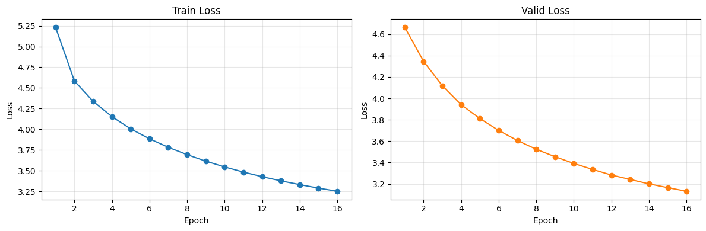

# Model Train and Evaluation: v0.3 실험 

## 1. 모델 학습 결과

### 실험 설정 비교

v0.3 실험은 v0.2 종합 평가에서 제안한 `100K update steps` 목표를 충족하도록 학습 데이터와 batch size를 조정한 실험입니다. v0.3 실험부터는 모델 학습 및 평가 과정을 W&B와 연동해 기록했습니다. W&B에 학습 loss, validation loss, BLEU, chrF, sample translations를 함께 기록했습니다. 실행 코드는 `notebooks/04_train_and_evaluate_wandb.ipynb` 노트북을 참고해주세요. 

| 항목 | v0.2 | v0.3 |
|---|---:|---:|
| **Train data size** | **100,000** | **200,000** |
| Valid data size | 2,000 | 2,000 |
| Test data size | 2,000 | 2,000 |
| **Epochs** | **20** | **16** |
| **Batch size** | **64** | **32** |
| Train batches / epoch | 1,563 | 6,250 |
| Valid batches | 32 | 63 |
| Test batches | 32 | 63 |
| Learning rate | 0.0001 | 0.0001 |
| Optimizer | Adam | Adam |
| Max sequence length | 128 | 128 |
| Source vocab size | 8,000 | 8,000 |
| Target vocab size | 8,000 | 8,000 |
| Parameters | 3,743,040 | 3,743,040 |
| **Approx. update steps** | **31,260** | **100,000** |
| Logging | Notebook output | W&B + notebook output |

변경 사항은 다음과 같습니다.

- 학습 데이터는 `100,000 -> 200,000`개로 2배 증가했습니다.
- Epoch는 `20 -> 16`으로 감소했습니다.
- Batch size는 `64 -> 32`로 감소했습니다.
- Batch size 감소와 데이터 증가로 update step은 약 `31.3K -> 100K`로 증가했습니다.
- 모델 구조, vocabulary size, optimizer, learning rate는 v0.2와 동일하게 유지했습니다.

### 학습 Loss

| Epoch | Train loss | Valid loss |
|---:|---:|---:|
| 1 | 5.2313 | 4.6638 |
| 2 | 4.5844 | 4.3449 |
| 3 | 4.3379 | 4.1180 |
| 4 | 4.1536 | 3.9408 |
| 5 | 4.0058 | 3.8108 |
| 6 | 3.8861 | 3.6997 |
| 7 | 3.7838 | 3.6055 |
| 8 | 3.6951 | 3.5236 |
| 9 | 3.6161 | 3.4545 |
| 10 | 3.5470 | 3.3915 |
| 11 | 3.4845 | 3.3356 |
| 12 | 3.4290 | 3.2832 |
| 13 | 3.3783 | 3.2418 |
| 14 | 3.3334 | 3.2005 |
| 15 | 3.2911 | 3.1655 |
| 16 | 3.2532 | 3.1315 |

학습 결과는 다음과 같습니다.

- Best validation loss는 epoch 16의 `3.1315`입니다.
- v0.2의 best validation loss `3.6289` 대비 `0.4974` 감소했습니다.
- Train loss와 valid loss가 모든 epoch에서 지속적으로 감소했습니다.
- Validation loss가 마지막 epoch까지 개선되었으므로, 현재 설정에서는 아직 underfitting 또는 추가 학습 여지가 남아 있을 가능성이 있습니다.
- 100K update steps를 충족했지만 loss가 plateau에 도달하지 않았기 때문에 다음 실험에서 epoch를 증가시키되 valid loss가 감소하지 않는 시점에 early stopping을 적용하는 것이 필요합니다.

## 2. 모델 평가 결과

### 평가 설정

| 항목 | 값 |
|---|---:|
| Evaluation notebook | `notebooks/04_train_and_evaluate_wandb.ipynb` |
| W&B run name | `experiment_03` |
| Checkpoint | `checkpoints/best.pt` |
| Checkpoint epoch | 16 |
| Checkpoint valid loss | 3.1315 |
| Test data size | 2,000 |
| Test batches | 63 |
| Predictions | 2,000 |
| References | 2,000 |
| Decode strategy | Greedy |
| Max decode length | 128 |

### 정량 평가

| Metric | v0.2 | v0.3 | 변화 |
|---|---:|---:|---:|
| BLEU | 4.6000 | 7.5670 | +2.9670 |
| chrF | 20.6694 | 26.5584 | +5.8890 |
| Best valid loss | 3.6289 | 3.1315 | -0.4974 |

정량 평가 결과는 다음과 같이 해석했습니다.

- v0.3는 v0.2 대비 BLEU와 chrF가 모두 개선되었습니다.
- BLEU는 `4.6000 -> 7.5670`으로 상승했습니다.
- chrF는 `20.6694 -> 26.5584`로 상승했습니다.
- Best validation loss도 `3.6289 -> 3.1315`로 낮아졌습니다.
- 그러나 BLEU `7.5670`은 여전히 낮은 점수입니다. 100K update steps를 충족했음에도 실사용 가능한 번역 품질에는 도달하지 못했습니다.
- Loss 개선과 metric 개선은 확인되지만, sample translation 기준 의미 보존 오류가 여전히 큽니다.

### Sample Translation 평가

| No. | Reference | Prediction | 주요 오류 유형 | 코멘트 |
|---:|---|---|---|---|
| 1 | The satin pillow comes in king size, and queen size. | The size of the size is a size and size. | 동어 반복, 문맥 불일치 | `size` 관련 단어는 잡았지만 satin pillow, king size, queen size의 구체 정보가 사라졌습니다. 반복 생성도 남아 있습니다. |
| 2 | Sorry, but your members are attacking us. | Sorry, I'm sorry, but we are looking forward to our research. | 부분 일치, 문맥 불일치 | `Sorry`는 맞았지만 attacking us 의미가 사라졌고 research 관련 문장으로 바뀌었습니다. |
| 3 | I am a hearty eater. | I like a diet. | 문맥 불일치 | 식사 관련 표현은 일부 생성했지만 hearty eater의 의미와 반대에 가까운 문장입니다. |
| 4 | Thank you for also sending the prototypes. | Thank you for sending a proposal. | 부분 일치, 문맥 불일치 | `Thank you for sending` 구조는 맞았지만 prototypes가 proposal로 바뀌었습니다. |
| 5 | That is all for now, and thank you for your patience. | That's right now, and thank you for your patience. | 부분 일치, 어색한 문장 | `thank you for your patience`는 정확히 생성했지만 `That is all for now`가 `That's right now`로 어색하게 바뀌었습니다. |
| 6 | Your question has been sent. | I've sent you the invoice of the invoice. | 동어 반복, 문맥 불일치 | sent 구조는 일부 맞았지만 question이 invoice로 바뀌었고 invoice가 반복되었습니다. |
| 7 | OK, we can watch a horror film. | OK, I like watching movies. | 부분 일치, 문맥 불일치 | OK와 movie 의미는 일부 맞았지만 can watch a horror film의 제안 의미가 사라졌습니다. |
| 8 | I'm not feeling so good. | I don't feel like it. | 부분 일치 | feeling 관련 부정 표현은 맞았지만 몸 상태가 좋지 않다는 의미보다는 의향 부재에 가깝습니다. |
| 9 | I want to express it and it's hard to hide. | I'm thinking about the situation and I want to make a good idea. | 부분 일치, 문맥 불일치 | `I want to` 구조는 일부 맞았지만 express/hide 의미가 유지되지 않았습니다. |
| 10 | You can also have Internet connection wherever you are in your home. | You can't go to the internet. | 의미 반전, 문맥 불일치 | Internet 단어는 맞았지만 가능하다는 의미가 불가능하다는 의미로 반전되었습니다. |

샘플 번역 평가 결과는 다음과 같습니다.

- v0.2보다 reference와 관련된 단어 또는 구문이 더 자주 등장했습니다.
- 일부 샘플에서는 문장 골격이 reference에 가까워졌습니다.
- 특히 5번 샘플은 `thank you for your patience`를 정확히 생성해 부분적인 개선이 확인되었습니다.
- 그러나 대부분의 샘플에서 핵심 의미 보존은 여전히 부족했습니다.
- 동어 반복, 문맥 불일치, 의미 반전이 계속 발생했습니다.
- 100K update steps를 충족했지만, 현재 모델 크기와 greedy decoding만으로는 번역 품질 개선에 한계가 있습니다.

## 3. 종합 평가

### 개선된 부분

v0.2 종합 평가에서는 100K update steps 충족, 데이터 확대, decoding 비교, learning rate schedule 및 모델 용량 점검이 필요하다고 평가했습니다. v0.3에서는 이 중 데이터 확대와 update step 증가가 반영되었고, 다음 개선이 확인되었습니다.

- 학습 데이터가 `100,000 -> 200,000`개로 증가했습니다.
- Batch size를 `64 -> 32`로 낮춰 optimizer update 횟수를 늘렸습니다.
- Approx. update steps가 약 `31.3K -> 100K`로 증가했습니다.
- Best validation loss가 `3.6289 -> 3.1315`로 개선되었습니다.
- BLEU가 `4.6000 -> 7.5670`으로 개선되었습니다.
- chrF가 `20.6694 -> 26.5584`로 개선되었습니다.
- 샘플 번역에서 reference와 관련된 단어 및 구문이 더 자주 등장했습니다.
- v0.2 대비 문장 골격이 일부 개선되었습니다.

### 추가로 개선이 필요한 부분

v0.3는 v0.2보다 개선되었지만, 아직 번역 품질은 낮습니다. 추가 개선이 필요한 부분은 다음과 같습니다.

- 100K update steps를 충족했지만 BLEU `7.5670`으로, 실사용 번역 품질에는 부족합니다.
- Train loss와 valid loss가 마지막 epoch까지 계속 감소했으므로, 현재 학습은 아직 plateau에 도달하지 않았습니다.
- Sample translation에서 핵심 의미 보존 실패가 계속 발생했습니다.
- 의미 반전, 동어 반복, 문맥 불일치가 여전히 남아 있습니다.
- Greedy decoding만 평가했기 때문에 beam search 결과와 비교해야 합니다.
- 현재 모델은 3.74M parameters로 작기 때문에 모델 용량 자체가 병목일 가능성이 있습니다.
- Learning rate warmup/decay scheduler는 아직 학습 코드에 반영되지 않았으므로 다음 실험에서 적용해야 합니다.

### 다음 실험 방향

다음 실험은 `v0.4 = deeper model + same 200K data + early stopping + scheduler` 방향으로 설정하는 것이 적절합니다. 현재 train loss와 valid loss가 모두 계속 감소하고 있으므로 epoch을 더 늘리는 판단은 타당합니다. 동시에 현재 모델은 3.74M parameters로 작기 때문에, epoch만 늘리기보다 모델 깊이와 feedforward 용량을 함께 키워 표현력을 보강하는 실험이 필요합니다.

- 학습 데이터: `200,000` 유지
- Batch size: `32` 유지
- Epoch: `16 -> 30~40`
- Encoder layers: `2 -> 3`
- Decoder layers: `2 -> 3`
- Feedforward dim: `256 -> 512`
- d_model: `128` 유지
- nhead: `4` 유지
- Early stopping: `patience=3~5`, `min_delta=0.001`
- Checkpoint 기준: best validation loss
- Learning rate: `1e-4` 유지
- Learning rate schedule: warmup `4,000 steps` + inverse square root decay 또는 linear decay 적용
- Decoding 비교: greedy decoding과 beam search를 모두 평가
- 평가 지표: BLEU, chrF, sample translation을 함께 비교

이 설정은 데이터 규모는 v0.3과 동일하게 유지하면서, 모델 구조와 학습 전략만 바꾸는 실험입니다. 따라서 v0.3 대비 개선이 발생하면 모델 용량 확대와 scheduler/early stopping 적용의 효과를 비교적 명확하게 확인할 수 있습니다. Colab T4에서 batch size 32가 OOM을 내면 batch size를 16으로 낮추고 gradient accumulation을 적용하는 방식으로 동일한 effective batch size를 맞추는 것이 좋습니다.
