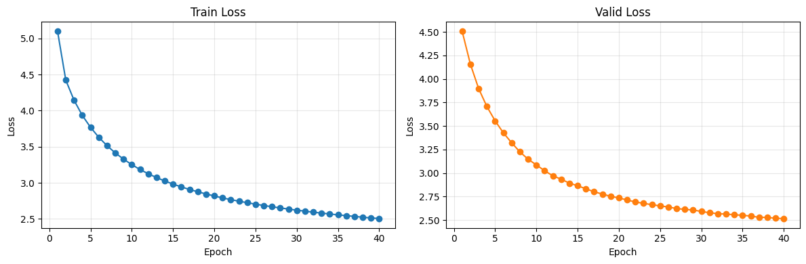

# Model Train and Evaluation: v0.4 실험

## 1. 모델 학습 결과

### 실험 설정 비교

v0.4 실험은 v0.3 종합 평가에서 제안한 `deeper model + same 200K data + early stopping + scheduler` 방향 중 모델 용량 확대, epoch 증가, early stopping, greedy/beam decoding 비교를 반영한 실험입니다. 실제 학습 및 평가는 `notebooks/04_train_and_evaluate_wandb.ipynb`에서 수행했으며, W&B run name은 `experiment_v0.4`입니다.

| 항목 | v0.3 | v0.4 |
|---|---:|---:|
| Train data size | 200,000 | 200,000 |
| Valid data size | 2,000 | 2,000 |
| Test data size | 2,000 | 2,000 |
| **Epochs** | **16** | **40** |
| Batch size | 32 | 32 |
| Train batches / epoch | 6,250 | 6,250 |
| Valid batches | 63 | 63 |
| Test batches | 63 | 63 |
| Learning rate | 0.0001 | 0.0001 |
| Optimizer | Adam | Adam |
| LR scheduler | 미적용 | 미적용 |
| **Early stopping** | 미적용 | **`patience=5`, `min_delta=0.001`** |
| Max sequence length | 128 | 128 |
| Source vocab size | 8,000 | 8,000 |
| Target vocab size | 8,000 | 8,000 |
| d_model | 128 | 128 |
| nhead | 4 | 4 |
| **Encoder layers** | **2** | **3** |
| **Decoder layers** | **2** | **3** |
| **Feedforward dim** | **256** | **512** |
| **Parameters** | **3,743,040** | **4,469,056** |
| **Approx. update steps** | **100,000** | **250,000** |
| Decoding evaluation | Greedy | Greedy + Beam |
| Logging | W&B + notebook output | W&B + notebook output |

변경 사항은 다음과 같습니다.

- 학습 데이터는 `200,000`개로 유지했습니다.
- Batch size는 `32`로 유지했습니다.
- Epoch는 `16 -> 40`으로 증가했습니다.
- Encoder/decoder layer는 `2 -> 3`으로 증가했습니다.
- Feedforward dim은 `256 -> 512`로 증가했습니다.
- Parameters는 `3,743,040 -> 4,469,056`으로 증가했습니다.
- Approx. update steps는 `100K -> 250K`로 증가했습니다.
- Early stopping은 적용했지만, validation loss가 끝까지 개선되어 실제 조기 종료는 발생하지 않았습니다.
- v0.3에서 제안했던 warmup/decay scheduler는 아직 적용되지 않았습니다.

### 학습 Loss

| Epoch | Train loss | Valid loss |
|---:|---:|---:|
| 1 | 5.0993 | 4.5071 |
| 2 | 4.4225 | 4.1571 |
| 3 | 4.1446 | 3.8975 |
| 4 | 3.9341 | 3.7069 |
| 5 | 3.7690 | 3.5546 |
| 6 | 3.6308 | 3.4270 |
| 7 | 3.5145 | 3.3222 |
| 8 | 3.4145 | 3.2251 |
| 9 | 3.3282 | 3.1469 |
| 10 | 3.2526 | 3.0864 |
| 11 | 3.1842 | 3.0245 |
| 12 | 3.1259 | 2.9707 |
| 13 | 3.0730 | 2.9353 |
| 14 | 3.0256 | 2.8928 |
| 15 | 2.9830 | 2.8647 |
| 16 | 2.9440 | 2.8331 |
| 17 | 2.9084 | 2.8007 |
| 18 | 2.8765 | 2.7770 |
| 19 | 2.8461 | 2.7527 |
| 20 | 2.8182 | 2.7358 |
| 21 | 2.7915 | 2.7136 |
| 22 | 2.7679 | 2.6929 |
| 23 | 2.7456 | 2.6781 |
| 24 | 2.7252 | 2.6638 |
| 25 | 2.7044 | 2.6506 |
| 26 | 2.6867 | 2.6395 |
| 27 | 2.6693 | 2.6227 |
| 28 | 2.6521 | 2.6141 |
| 29 | 2.6373 | 2.6074 |
| 30 | 2.6213 | 2.5917 |
| 31 | 2.6079 | 2.5782 |
| 32 | 2.5935 | 2.5684 |
| 33 | 2.5810 | 2.5645 |
| 34 | 2.5689 | 2.5561 |
| 35 | 2.5559 | 2.5514 |
| 36 | 2.5460 | 2.5428 |
| 37 | 2.5350 | 2.5293 |
| 38 | 2.5238 | 2.5293 |
| 39 | 2.5147 | 2.5190 |
| 40 | 2.5052 | 2.5162 |

학습 결과는 다음과 같습니다.

- Best validation loss는 epoch 40의 `2.5162`입니다.
- v0.3의 best validation loss `3.1315` 대비 `0.6153` 감소했습니다.
- Train loss와 valid loss가 전반적으로 안정적으로 감소했습니다.
- Epoch 38에서 `min_delta=0.001` 기준 improvement가 없어 `no validation improvement (1/5)`가 기록되었지만, 이후 epoch 39와 40에서 다시 개선되었습니다.
- Early stopping은 설정되었지만 `patience=5`에 도달하지 않아 trigger되지 않았습니다.
- 40 epoch에서도 valid loss가 plateau에 완전히 도달하지 않았으므로 추가 학습 여지는 남아 있습니다.

## 2. 모델 평가 결과

### 평가 설정

| 항목 | 값 |
|---|---:|
| Evaluation notebook | `notebooks/04_train_and_evaluate_wandb.ipynb` |
| W&B run name | `experiment_v0.4` |
| Checkpoint | `checkpoints/best.pt` |
| Checkpoint epoch | 40 |
| Checkpoint valid loss | 2.5162 |
| Test data size | 2,000 |
| Test batches | 63 |
| Predictions | 2,000 |
| References | 2,000 |
| Greedy decoding | 사용 |
| Beam search | 사용, beam size 5 |
| Max decode length | 128 |

### 정량 평가

| Metric | v0.3 | v0.4 Greedy | 변화 |
|---|---:|---:|---:|
| BLEU | 7.5670 | 11.8581 | +4.2911 |
| chrF | 26.5584 | 34.9731 | +8.4147 |
| Best valid loss | 3.1315 | 2.5162 | -0.6153 |

| Decode strategy | Beam size | BLEU | chrF |
|---|---:|---:|---:|
| Greedy | 1 | 11.8581 | 34.9731 |
| Beam | 5 | 12.5352 | 35.0741 |

정량 평가 결과는 다음과 같이 해석했습니다.

- v0.4는 v0.3 대비 BLEU와 chrF가 모두 개선되었습니다.
- Greedy BLEU는 `7.5670 -> 11.8581`로 상승했습니다.
- Greedy chrF는 `26.5584 -> 34.9731`로 상승했습니다.
- Beam search는 greedy보다 BLEU `+0.6771`, chrF `+0.1010` 개선되었습니다.
- Beam search 개선 폭은 크지 않지만, 현재 모델에서는 greedy보다 beam decoding이 약간 유리했습니다.
- BLEU `12.5352`는 이전 실험 대비 의미 있는 개선이지만, 여전히 안정적인 번역 품질로 보기에는 낮습니다.

### Sample Translation 평가

| No. | Reference | Greedy Prediction | Beam Prediction | 주요 오류 유형 | 코멘트 |
|---:|---|---|---|---|---|
| 1 | The satin pillow comes in king size, and queen size. | The pillow is equipped with a queen-size size and queen-size pillow. | It has a queen-size size and queen-size pillow. | 부분 일치, 동어 반복 | pillow, queen-size를 생성해 v0.3보다 개선되었지만 king size가 빠졌고 size/pillow 반복이 남았습니다. |
| 2 | Sorry, but your members are attacking us. | I'm sorry, but we're looking forward to the attack of our community. | I'm sorry, but I'm sorry for the attack. | 부분 일치, 문맥 불일치 | sorry와 attack은 잡았지만 members attacking us의 주체/피해 관계가 제대로 보존되지 않았습니다. |
| 3 | I am a hearty eater. | I like it because I like it. | I like my mind. | 문맥 불일치 | v0.3과 마찬가지로 hearty eater 의미를 반영하지 못했습니다. |
| 4 | Thank you for also sending the prototypes. | Thank you for sending me a prototype. | Thank you for sending me a prototype. | 부분 일치 | prototype 관련 의미가 처음으로 비교적 잘 반영되었습니다. 다만 also와 복수 prototypes는 빠졌습니다. |
| 5 | That is all for now, and thank you for your patience. | Thank you for waiting, and I'm just waiting for your patience. | Thank you for waiting, and I'll wait for your patience. | 부분 일치, 어색한 문장 | patience/waiting 의미는 반영했지만 `That is all for now` 의미가 빠졌고 waiting 반복이 어색합니다. |
| 6 | Your question has been sent. | I have sent you a query from the company. | We have been sending you the inquiry you sent. | 부분 일치, 문맥 불일치 | question/query/inquiry와 sent 의미는 잡았지만 문장 주체와 의미가 정확하지 않습니다. |
| 7 | OK, we can watch a horror film. | OK, let's see the horrrrrrrrrrrrrrrrrrrrrrrrrrrrrrrrrrrrrrrrrrrrrrrrrrrrror. | OK, let's see the movie. | 부분 일치, 동어 반복 | beam은 movie 문장으로 더 자연스럽지만 horror 정보가 빠졌습니다. greedy는 horror를 잡았으나 문자 반복 오류가 심합니다. |
| 8 | I'm not feeling so good. | I don't feel good. | I don't feel good. | 의미 일치 | reference와 의미가 거의 일치하는 좋은 번역입니다. |
| 9 | I want to express it and it's hard to hide. | It's a hard time to express my mind. | It's hard to express my mind. | 부분 일치 | express와 hard 의미를 잘 반영했습니다. hide 의미는 빠졌지만 v0.3보다 크게 개선되었습니다. |
| 10 | You can also have Internet connection wherever you are in your home. | You can access to the Internet or anywhere. | You can not access to the Internet or anywhere. | 부분 일치, 의미 반전 | greedy는 Internet/access 의미를 일부 반영했지만 문장이 어색합니다. beam은 부정 표현으로 의미가 반전되었습니다. |

샘플 번역 평가 결과는 다음과 같습니다.

- v0.3보다 source 문장의 핵심 단어를 더 잘 반영했습니다.
- `prototype`, `I don't feel good`, `express my mind`, `Internet`처럼 reference와 직접 관련된 표현이 늘었습니다.
- 일부 샘플은 의미가 상당히 가까워졌습니다.
- 그러나 동어 반복, 문맥 불일치, 주체/객체 오류, 의미 반전은 여전히 발생했습니다.
- Beam search는 평균 metric은 약간 개선했지만, 모든 샘플에서 greedy보다 좋은 것은 아니었습니다.

## 3. 종합 평가

### 개선된 부분

v0.3 종합 평가에서는 deeper model, same 200K data, early stopping, scheduler, beam search 비교를 다음 실험 방향으로 제안했습니다. v0.4에서는 이 중 모델 용량 확대, epoch 증가, early stopping, beam search 비교가 반영되었고, 다음 개선이 확인되었습니다.

- Encoder/decoder layer가 `2 -> 3`으로 증가했습니다.
- Feedforward dim이 `256 -> 512`로 증가했습니다.
- Parameters가 `3.74M -> 4.47M`으로 증가했습니다.
- Epoch가 `16 -> 40`으로 증가했습니다.
- Approx. update steps가 `100K -> 250K`로 증가했습니다.
- Early stopping 로직이 추가되었습니다.
- Greedy와 beam search를 모두 평가했습니다.
- Best validation loss가 `3.1315 -> 2.5162`로 개선되었습니다.
- Greedy BLEU가 `7.5670 -> 11.8581`로 개선되었습니다.
- Greedy chrF가 `26.5584 -> 34.9731`로 개선되었습니다.
- Beam search 기준 BLEU `12.5352`, chrF `35.0741`로 greedy보다 소폭 개선되었습니다.
- Sample translation에서 reference와 직접 관련된 단어와 구문이 더 자주 생성되었습니다.

### 추가로 개선이 필요한 부분

v0.4는 v0.3보다 분명히 개선되었지만, 아직 번역 품질은 충분하지 않습니다. 추가 개선이 필요한 부분은 다음과 같습니다.

- BLEU `12.5352`는 이전보다 개선된 수치지만 실사용 번역 품질로 보기에는 여전히 낮습니다.
- 250K update steps와 deeper model에도 valid loss가 마지막 epoch까지 개선되어 plateau에 완전히 도달하지 않았습니다.
- Early stopping은 추가되었지만 실제로 trigger되지는 않았습니다.
- v0.3에서 제안한 warmup/decay scheduler는 아직 적용되지 않았습니다.
- Beam search는 평균 metric을 소폭 개선했지만, 일부 샘플에서는 의미 반전이나 정보 누락이 발생했습니다.
- Sample translation에서 동어 반복, 주체/객체 오류, 문맥 불일치가 여전히 남아 있습니다.
- 현재 `d_model=128`은 유지되었으므로, 모델의 hidden representation 용량은 여전히 작은 편입니다.

### 다음 실험 방향

다음 실험은 v0.4에서 확인된 개선 흐름을 유지하되, scheduler와 모델 width를 보강하는 방향이 적절합니다. v0.4에서 깊이와 FFN 확대는 효과가 있었지만, 아직 표현력과 학습 안정성이 충분하지 않은 것으로 보입니다.

- 학습 데이터: `200,000` 유지 또는 `500,000`으로 확대
- Batch size: `32` 유지
- Epoch: `40 -> 50~60`
- Early stopping: `patience=5`, `min_delta=0.001` 유지
- Encoder layers: `3` 유지
- Decoder layers: `3` 유지
- Feedforward dim: `512` 유지
- d_model: `128 -> 256` 실험
- nhead: `4 -> 8` 실험
- Learning rate: `1e-4` 유지 또는 scheduler 적용 시 peak lr 재검토
- Learning rate schedule: warmup `4,000 steps` + inverse square root decay 우선 적용
- Decoding: beam size `3`, `5`, length penalty 적용 여부 비교
- 평가 지표: BLEU, chrF, sample translation, 반복 생성 케이스를 함께 비교

현재 결과를 기준으로는 단순히 epoch만 늘리는 것보다, `d_model=256 / nhead=8 / scheduler 적용`을 우선 실험하는 편이 더 타당합니다. v0.4에서 loss와 metric이 모두 개선되었기 때문에 학습 방향은 맞지만, 의미 보존 오류가 계속 남아 있어 모델 width, scheduler, decoding penalty를 함께 점검해야 합니다.
