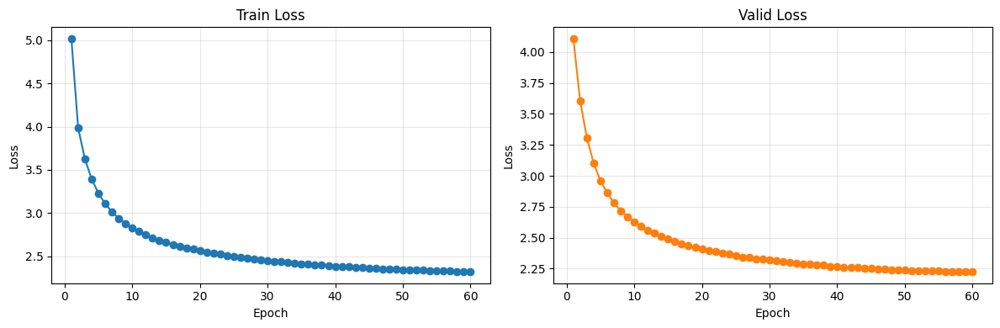

# Model Train and Evaluation: v0.5 실험

## 1. 기술적 의사결정 사항

v0.5 실험은 v0.4 대비 모델 구조와 데이터 규모를 크게 바꾸기보다, 학습 안정성과 학습 처리량을 개선하는 방향으로 준비합니다. 핵심 변경은 다음 두 가지입니다.

- LR scheduler 적용
- 데이터 토크나이징 병목 최적화

## 1-1. LR Scheduler 적용

v0.4까지는 learning rate를 `1e-4`로 고정했습니다. v0.5에서는 Transformer 학습 초반 안정성과 후반 수렴을 개선하기 위해 optimizer update step 단위의 scheduler를 적용합니다.

최종 결정은 다음과 같습니다.

| 항목 | 결정 |
|---|---|
| Scheduler 적용 여부 | 적용 |
| Scheduler 방식 | Linear warmup + linear decay |
| Warmup 기준 | 고정 warmup steps |
| Warmup steps | `4000` |
| Peak learning rate | 기존 `config.lr = 1e-4` 유지 |
| Scheduler step 단위 | Batch/update step 단위 |

Scheduler 후보는 다음과 같이 검토했습니다.

| 옵션 | 판단 |
|---|---|
| Constant LR | v0.4까지의 baseline입니다. 초반 warmup과 후반 decay가 없습니다. |
| Linear warmup + constant | 초반 안정성은 확보하지만 후반 수렴 조정 효과가 약합니다. |
| Linear warmup + linear decay | 구현과 해석이 단순하고 scheduler baseline으로 적합합니다. v0.5 최종 선택입니다. |
| Cosine / inverse sqrt decay | 후속 실험 후보입니다. v0.5에서는 scheduler 변수 자체를 단순하게 유지합니다. |
| ReduceLROnPlateau / OneCycleLR | early stopping, peak LR 등 추가 변수가 섞이므로 현재 단계에서는 우선순위가 낮습니다. |

`warmup_steps=4000`으로 결정한 이유는 다음과 같습니다.

- 현재 설정 기준 총 update step은 약 `250,000`입니다.
- `warmup_ratio=0.1`을 쓰면 warmup이 약 `25,000` steps, 약 4 epochs로 길어집니다.
- `warmup_steps=4000`은 약 0.64 epoch에 해당해, 초반 안정성을 확보하면서 빠르게 peak LR에 도달합니다.
- v0.5에서는 모델 구조와 데이터 규모를 유지하면서 scheduler 효과를 분리해 확인하는 것이 목적입니다.

| Warmup 방식 | Warmup 길이 | 판단 |
|---|---:|---|
| `warmup_ratio=0.1` | 약 `25,000` steps | 현재 실험에는 다소 긴 편입니다. |
| `warmup_steps=4000` | `4,000` steps | v0.5 최종 선택입니다. |

## 1-2. 데이터 토크나이징 병목 최적화

v0.5 이후 실험에서는 학습 데이터와 epoch 수가 커지므로, DataLoader 단계의 CPU 병목도 함께 줄이는 것이 필요합니다. 현재 `TranslationDataset.__getitem__()`은 batch를 만들 때마다 SentencePiece `encode()`를 수행합니다. 이 구조에서는 같은 문장이 epoch마다 반복 토크나이징되므로, GPU가 충분히 빠르더라도 CPU 토크나이징과 data loading이 병목이 될 수 있습니다.

적용할 변경은 다음과 같습니다.

| 항목 | 현재 방식 | 변경 방식 |
|---|---|---|
| Tokenization 시점 | `__getitem__()` 호출 시 매번 수행 | `TranslationDataset` 생성 시 1회 수행 |
| Cache 위치 | 없음 | 메모리 내 `examples` list |
| `__getitem__()` 역할 | text를 token ids로 변환 후 반환 | 사전 변환된 token ids 반환 |
| Padding | batch별 dynamic padding | 기존 방식 유지 |
| Train/evaluate batch format | `src_ids`, `tgt_ids`, `src_texts`, `tgt_texts` | 기존 key 유지 |
| DataLoader 옵션 | 기본값 | `num_workers`, `pin_memory`, `persistent_workers` 설정 추가 |

구현 방향은 다음과 같습니다.

- `TranslationDataset.__init__()`에서 `src_ids`, `tgt_ids`를 미리 생성합니다.
- `TranslationDataset.__getitem__()`은 사전 토크나이징된 example만 반환하도록 단순화합니다.
- `collate_fn()`의 dynamic padding 방식은 유지합니다.
- `create_dataloaders()`의 반환 인터페이스는 유지해 `train.py`, `evaluate.py`, notebook 변경을 최소화합니다.
- `Config`에 DataLoader 관련 옵션을 추가합니다.

추가할 설정값은 다음과 같습니다.

| 설정 | 기본값 | 설명 |
|---|---:|---|
| `pretokenize_dataset` | `True` | Dataset 생성 시 전체 문장을 미리 token ids로 변환합니다. |
| `num_workers` | `2` | Colab 기준 DataLoader worker 수입니다. 문제가 있으면 `0`으로 낮춥니다. |
| `pin_memory` | `True` | CUDA 학습 시 CPU tensor를 pinned memory에 올려 GPU 전송을 개선합니다. |
| `persistent_workers` | `True` | `num_workers > 0`일 때 worker를 epoch 사이에 유지합니다. |

기대 효과와 주의사항은 다음과 같습니다.

- epoch마다 반복되는 SentencePiece 토크나이징 비용을 제거합니다.
- GPU utilization이 낮은 경우 CPU/data loading 병목을 줄일 수 있습니다.
- A100처럼 더 빠른 GPU를 사용할 때 data loading 대기 시간을 줄이는 데 도움이 됩니다.
- 학습/평가 batch key는 유지하므로 영향 범위는 `data_pipeline.py`, `config.py` 중심입니다.
- Dataset 생성 초기에 토크나이징 시간이 한 번 발생합니다.
- Token ids를 메모리에 저장하므로 CPU RAM 사용량이 증가합니다.
- Colab에서는 `num_workers=2~4`를 시도할 수 있지만, 로컬 Windows notebook 환경에서는 worker 문제가 생기면 `num_workers=0`으로 낮추는 것이 안전합니다.

따라서 v0.5에서는 `LR scheduler 적용`과 `메모리 사전 토크나이징 + DataLoader 옵션 추가`를 함께 반영합니다. 전자는 학습 안정성과 수렴을 위한 변경이고, 후자는 대규모/장기 학습에서 학습 시간을 줄이고 GPU 사용률을 높이기 위한 기반 최적화입니다.

## 2. 모델 학습 결과

### 실험 설정 비교

v0.5 실험은 v0.4의 모델 구조를 유지하면서 학습 데이터 확대, epoch 증가, LR scheduler 적용, DataLoader 최적화를 반영한 실험입니다. 실제 학습 및 평가는 `notebooks/04_train_and_evaluate_wandb.ipynb`에서 수행했으며, W&B run name은 `experiment_v0.5`입니다.

| 항목 | v0.4 | v0.5 |
|---|---:|---:|
| Train data size | 200,000 | 500,000 |
| Valid data size | 2,000 | 2,000 |
| Test data size | 2,000 | 2,000 |
| Epochs | 40 | 60 |
| Batch size | 32 | 32 |
| Train batches / epoch | 6,250 | 15,625 |
| Valid batches | 63 | 63 |
| Test batches | 63 | 63 |
| Learning rate | 0.0001 | 0.0001 |
| Optimizer | Adam | Adam |
| LR scheduler | 미적용 | Linear warmup + linear decay |
| Warmup steps | - | 4,000 |
| Early stopping | `patience=5`, `min_delta=0.001` | `patience=5`, `min_delta=0.001` |
| Pretokenize dataset | 미적용 | 적용 |
| DataLoader workers | 기본값 | 2 |
| Pin memory | 기본값 | True |
| Persistent workers | 기본값 | True |
| Max sequence length | 128 | 128 |
| Source vocab size | 8,000 | 8,000 |
| Target vocab size | 8,000 | 8,000 |
| d_model | 128 | 128 |
| nhead | 4 | 4 |
| Encoder layers | 3 | 3 |
| Decoder layers | 3 | 3 |
| Feedforward dim | 512 | 512 |
| Parameters | 4,469,056 | 4,469,056 |
| Approx. update steps | 250,000 | 937,500 |
| Decoding evaluation | Greedy + Beam | Greedy + Beam |
| Logging | W&B + notebook output | W&B + notebook output |

변경 사항은 다음과 같습니다.

- 학습 데이터는 `200,000 -> 500,000`개로 증가했습니다.
- Epoch는 `40 -> 60`으로 증가했습니다.
- 모델 구조와 parameter 수는 v0.4와 동일하게 유지했습니다.
- LR scheduler는 `linear warmup + linear decay`로 적용했습니다.
- Warmup은 `4,000 steps`로 적용했습니다.
- 데이터 파이프라인에는 메모리 사전 토크나이징과 DataLoader worker 설정을 적용했습니다.
- Approx. update steps는 `250K -> 937.5K`로 크게 증가했습니다.

### 학습 Loss

| Epoch | Train loss | Valid loss | LR |
|---:|---:|---:|---:|
| 1 | 5.0148 | 4.1067 | 0.00009875 |
| 2 | 3.9831 | 3.6036 | 0.00009708 |
| 3 | 3.6250 | 3.3060 | 0.00009541 |
| 4 | 3.3930 | 3.1005 | 0.00009373 |
| 5 | 3.2285 | 2.9593 | 0.00009206 |
| 6 | 3.1074 | 2.8625 | 0.00009039 |
| 7 | 3.0138 | 2.7799 | 0.00008871 |
| 8 | 2.9402 | 2.7178 | 0.00008704 |
| 9 | 2.8789 | 2.6701 | 0.00008536 |
| 10 | 2.8294 | 2.6288 | 0.00008369 |
| 11 | 2.7862 | 2.5912 | 0.00008202 |
| 12 | 2.7489 | 2.5616 | 0.00008034 |
| 13 | 2.7165 | 2.5359 | 0.00007867 |
| 14 | 2.6874 | 2.5139 | 0.00007700 |
| 15 | 2.6617 | 2.4887 | 0.00007532 |
| 16 | 2.6391 | 2.4674 | 0.00007365 |
| 17 | 2.6179 | 2.4468 | 0.00007197 |
| 18 | 2.5986 | 2.4383 | 0.00007030 |
| 19 | 2.5811 | 2.4198 | 0.00006863 |
| 20 | 2.5655 | 2.4070 | 0.00006695 |
| 21 | 2.5513 | 2.3965 | 0.00006528 |
| 22 | 2.5364 | 2.3853 | 0.00006360 |
| 23 | 2.5233 | 2.3716 | 0.00006193 |
| 24 | 2.5110 | 2.3667 | 0.00006026 |
| 25 | 2.4993 | 2.3540 | 0.00005858 |
| 26 | 2.4892 | 2.3440 | 0.00005691 |
| 27 | 2.4789 | 2.3379 | 0.00005524 |
| 28 | 2.4692 | 2.3302 | 0.00005356 |
| 29 | 2.4604 | 2.3258 | 0.00005189 |
| 30 | 2.4518 | 2.3175 | 0.00005021 |
| 31 | 2.4434 | 2.3129 | 0.00004854 |
| 32 | 2.4364 | 2.3050 | 0.00004687 |
| 33 | 2.4283 | 2.3027 | 0.00004519 |
| 34 | 2.4213 | 2.2965 | 0.00004352 |
| 35 | 2.4148 | 2.2881 | 0.00004185 |
| 36 | 2.4084 | 2.2832 | 0.00004017 |
| 37 | 2.4025 | 2.2777 | 0.00003850 |
| 38 | 2.3967 | 2.2771 | 0.00003682 |
| 39 | 2.3915 | 2.2687 | 0.00003515 |
| 40 | 2.3863 | 2.2682 | 0.00003348 |
| 41 | 2.3814 | 2.2601 | 0.00003180 |
| 42 | 2.3770 | 2.2596 | 0.00003013 |
| 43 | 2.3717 | 2.2565 | 0.00002845 |
| 44 | 2.3681 | 2.2516 | 0.00002678 |
| 45 | 2.3638 | 2.2501 | 0.00002511 |
| 46 | 2.3595 | 2.2464 | 0.00002343 |
| 47 | 2.3559 | 2.2441 | 0.00002176 |
| 48 | 2.3528 | 2.2407 | 0.00002009 |
| 49 | 2.3489 | 2.2397 | 0.00001841 |
| 50 | 2.3462 | 2.2387 | 0.00001674 |
| 51 | 2.3435 | 2.2352 | 0.00001506 |
| 52 | 2.3402 | 2.2339 | 0.00001339 |
| 53 | 2.3380 | 2.2330 | 0.00001172 |
| 54 | 2.3351 | 2.2312 | 0.00001004 |
| 55 | 2.3330 | 2.2297 | 0.00000837 |
| 56 | 2.3307 | 2.2279 | 0.00000670 |
| 57 | 2.3297 | 2.2269 | 0.00000502 |
| 58 | 2.3269 | 2.2267 | 0.00000335 |
| 59 | 2.3259 | 2.2265 | 0.00000167 |
| 60 | 2.3243 | 2.2260 | 0.00000000 |

학습 결과는 다음과 같습니다.

- Raw validation loss는 epoch 60의 `2.2260`까지 감소했습니다.
- v0.4의 final validation loss `2.5162` 대비 `0.2902` 감소했습니다.
- Early stopping 기준으로는 epoch 60까지 `patience=5`에 도달하지 않아 조기 종료되지 않았습니다.
- `min_delta=0.001` 기준 best checkpoint는 epoch 58의 `2.2267`로 기록되었고, epoch 59~60은 improvement로 인정되지 않았습니다.
- LR scheduler는 epoch이 진행될수록 learning rate를 점진적으로 감소시켰고, epoch 60에서 `0.00000000`에 도달했습니다.
- 후반부 valid loss 개선 폭은 매우 작아져 plateau에 가까워졌습니다.

## 3. 모델 평가 결과

### 평가 설정

| 항목 | 값 |
|---|---:|
| Evaluation notebook | `notebooks/04_train_and_evaluate_wandb.ipynb` |
| W&B run name | `experiment_v0.5` |
| Evaluation model | epoch 60 final in-memory model |
| Best checkpoint 기준 | epoch 58, valid loss 2.2267 |
| Final valid loss | 2.2260 |
| Test data size | 2,000 |
| Test batches | 63 |
| Predictions | 2,000 |
| References | 2,000 |
| Greedy decoding | 사용 |
| Beam search | 사용, beam size 5 |
| Max decode length | 128 |

### 정량 평가

| Metric | v0.4 Greedy | v0.5 Greedy | 변화 |
|---|---:|---:|---:|
| BLEU | 11.8581 | 14.5666 | +2.7085 |
| chrF | 34.9731 | 38.1843 | +3.2112 |
| Final valid loss | 2.5162 | 2.2260 | -0.2902 |

| Decode strategy | Beam size | BLEU | chrF |
|---|---:|---:|---:|
| Greedy | 1 | 14.5666 | 38.1843 |
| Beam | 5 | 15.4420 | 38.3198 |

정량 평가 결과는 다음과 같이 해석했습니다.

- v0.5는 v0.4 대비 BLEU와 chrF가 모두 개선되었습니다.
- Greedy BLEU는 `11.8581 -> 14.5666`으로 상승했습니다.
- Greedy chrF는 `34.9731 -> 38.1843`으로 상승했습니다.
- Beam search는 greedy보다 BLEU `+0.8754`, chrF `+0.1355` 개선되었습니다.
- v0.4 대비 metric은 개선되었지만, BLEU `15.4420`은 여전히 안정적인 번역 품질로 보기에는 낮습니다.
- LR scheduler와 데이터 확대는 loss와 metric 모두에 긍정적인 영향을 준 것으로 보입니다.

### Sample Translation 평가

| No. | Reference | Greedy Prediction | Beam Prediction | 주요 오류 유형 | 코멘트 |
|---:|---|---|---|---|---|
| 1 | The satin pillow comes in king size, and queen size. | The pillow has a queen-size pillow and queen-size pillow. | The pillow has a queen size and queen-size pillow. | 부분 일치, 동어 반복 | pillow와 queen size는 반영했지만 satin, king size가 빠졌고 pillow 반복이 남았습니다. |
| 2 | Sorry, but your members are attacking us. | I'm sorry, but we are attacking our members. | I'm sorry, but we are attacking our members. | 부분 일치, 의미 반전 | sorry와 attacking은 반영했지만 공격 주체/대상이 반전되었습니다. |
| 3 | I am a hearty eater. | I feel comfortable to eat. | I feel comfortable to eat. | 부분 일치 | eat 관련 표현은 생성했지만 hearty eater의 자연스러운 의미와는 다릅니다. |
| 4 | Thank you for also sending the prototypes. | Thank you for sending the prototype. | Thank you for sending the prototype. | 의미 근접 | prototypes 관련 의미가 잘 반영되었습니다. also와 복수형 정보는 빠졌습니다. |
| 5 | That is all for now, and thank you for your patience. | I'm just waiting for that, and thank you for waiting. | That's all right now, and thank you for waiting. | 부분 일치, 어색한 문장 | thank you/waiting은 반영했지만 `That is all for now`와 `patience` 의미가 정확하지 않습니다. |
| 6 | Your question has been sent. | You have sent us the contents you sent. | Your inquiry has been sent. | 의미 근접 | beam 결과는 inquiry has been sent로 reference와 매우 가깝습니다. |
| 7 | OK, we can watch a horror film. | OK, let's see a horrrror movie. | OK, let's see the movie. | 부분 일치, 반복 | movie 의미는 맞지만 horror 정보가 greedy에서 문자 반복으로 깨졌고 beam에서는 horror가 빠졌습니다. |
| 8 | I'm not feeling so good. | I don't feel good. | I don't feel good. | 의미 일치 | reference와 의미가 거의 일치하는 좋은 번역입니다. |
| 9 | I want to express it and it's hard to hide. | It's a hard thing that I want to hide it. | It's a hard thing that I want to hide it. | 부분 일치 | hard/hide 의미는 반영했지만 express 의미가 빠졌습니다. |
| 10 | You can also have Internet connection wherever you are in your home. | You can access to the internet anywhere. | You can access to the internet anywhere. | 의미 근접 | Internet access와 anywhere 의미를 잘 반영했습니다. home 정보는 빠졌습니다. |

샘플 번역 평가 결과는 다음과 같습니다.

- v0.4보다 의미가 가까운 샘플이 늘었습니다.
- 4번, 6번 beam, 8번, 10번은 reference와 상당히 가까운 번역입니다.
- Beam search는 평균 metric을 소폭 개선했고, 일부 샘플에서는 greedy보다 더 자연스럽거나 정확했습니다.
- 그러나 주체/객체 반전, 정보 누락, 반복 생성은 여전히 발생했습니다.
- 긴 의미 구조나 세부 속성 정보는 아직 안정적으로 보존하지 못합니다.

## 4. 종합 평가

### 개선된 부분

v0.4 종합 평가에서는 scheduler, 모델 width, decoding penalty, 데이터 확대를 다음 개선 방향으로 제안했습니다. v0.5에서는 이 중 학습 데이터 확대, LR scheduler, DataLoader 최적화, 긴 epoch 학습이 반영되었고 다음 개선이 확인되었습니다.

- 학습 데이터가 `200,000 -> 500,000`개로 증가했습니다.
- Approx. update steps가 `250K -> 937.5K`로 증가했습니다.
- Linear warmup + linear decay scheduler가 적용되었습니다.
- 메모리 사전 토크나이징과 DataLoader worker 설정이 적용되었습니다.
- Raw valid loss가 `2.5162 -> 2.2260`으로 개선되었습니다.
- Greedy BLEU가 `11.8581 -> 14.5666`으로 개선되었습니다.
- Greedy chrF가 `34.9731 -> 38.1843`으로 개선되었습니다.
- Beam search 기준 BLEU `15.4420`, chrF `38.3198`로 greedy보다 소폭 개선되었습니다.
- Sample translation에서 의미 근접 사례가 늘었습니다.

### 추가로 개선이 필요한 부분

v0.5는 v0.4보다 개선되었지만, 아직 번역 품질은 충분하지 않습니다. 추가 개선이 필요한 부분은 다음과 같습니다.

- BLEU `15.4420`은 개선된 수치지만 실사용 번역 품질로 보기에는 여전히 낮습니다.
- 후반 valid loss 개선 폭이 작아져 LR이 너무 낮아진 상태에서 학습이 둔화되었을 가능성이 있습니다.
- Linear decay가 epoch 60에서 LR을 0까지 낮추므로, 장기 학습에서는 `min_lr_ratio` 또는 cosine/inverse sqrt decay 비교가 필요합니다.
- 일부 샘플에서 의미 반전과 정보 누락이 계속 발생했습니다.
- `d_model=128`, `nhead=4`는 유지되었으므로 hidden representation 용량은 여전히 작은 편입니다.
- Beam search는 평균 metric을 개선했지만, 오류 유형을 완전히 해결하지는 못했습니다.

### 다음 실험 방향

다음 실험은 v0.5에서 확인된 개선 흐름을 유지하되, scheduler decay 정책과 모델 width를 점검하는 방향이 적절합니다.

- 학습 데이터: `500,000` 유지
- Batch size: `32` 유지
- Epoch: `60` 유지 또는 `70~80`으로 확대
- Early stopping: `patience=5`, `min_delta=0.001` 유지
- Encoder layers: `3` 유지
- Decoder layers: `3` 유지
- Feedforward dim: `512` 유지
- d_model: `128 -> 256` 실험
- nhead: `4 -> 8` 실험
- LR scheduler: linear decay + `min_lr_ratio` 적용 또는 inverse sqrt/cosine decay 비교
- Decoding: beam size `3`, `5`, length penalty 적용 여부 비교
- 평가 지표: BLEU, chrF, sample translation, 의미 반전/반복 생성 케이스를 함께 비교

현재 결과를 기준으로는 데이터와 scheduler 적용이 성능 개선에 도움이 되었습니다. 다음 병목은 모델 width와 decay 정책일 가능성이 큽니다. 특히 LR이 0까지 내려가는 linear decay는 장기 학습 후반을 지나치게 약하게 만들 수 있으므로, 다음 실험에서는 `d_model=256 / nhead=8`과 함께 `min_lr_ratio` 또는 inverse sqrt decay를 우선 비교하는 것이 좋습니다.
