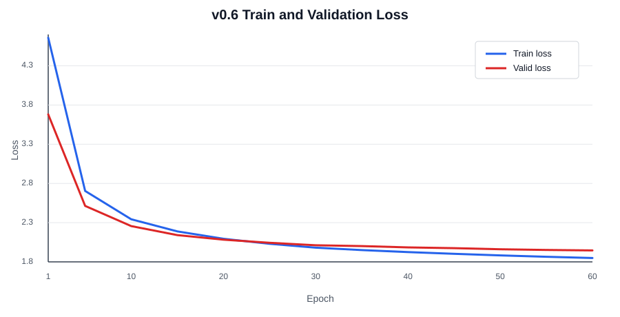

# Model Train and Evaluation: v0.6 실험

## 1. 기술적 의사결정 사항

v0.6 실험은 v0.5에서 확인된 다음 병목을 기준으로 설계합니다.

- 모델 표현력 부족 가능성
- 장기 학습 후반부 learning rate가 `0`까지 감소하는 문제
- 데이터/epoch 확대 효과와 모델 구조 변경 효과를 분리해 비교할 필요

따라서 v0.6에서는 학습 데이터, epoch, batch size, layer depth는 v0.5와 동일하게 유지하고, 모델 width와 LR decay 정책만 조정합니다.

- 모델 표현력 확대: `d_model=128 -> 256`, `nhead=4 -> 8`
- LR scheduler 개선: `linear warmup + linear decay`에 `min_lr_ratio` 적용
- 비교 기준 유지: train data `500,000`, epoch `60`, batch size `32` 유지

## 1-1. 모델 표현력 확대

v0.5는 학습 데이터 확대와 scheduler 적용으로 loss와 BLEU/chrF가 모두 개선되었습니다. 다만 `d_model=128`, `nhead=4`는 Transformer 기준으로 작은 편이며, sample translation에서는 여전히 의미 반전, 정보 누락, 반복 생성이 발생했습니다.

v0.6에서는 모델의 hidden representation과 attention head 수를 늘려 번역 표현력을 확대합니다.

| 항목 | v0.5 | v0.6 |
|---|---:|---:|
| Train data size | 500,000 | 500,000 |
| Epochs | 60 | 60 |
| Batch size | 32 | 32 |
| d_model | 128 | **256** |
| nhead | 4 | **8** |
| Encoder layers | 3 | 3 |
| Decoder layers | 3 | 3 |
| Feedforward dim | 512 | 512 |
| Early stopping | `patience=5`, `min_delta=0.001` | `patience=5`, `min_delta=0.001` |
| Pretokenize dataset | 적용 | 적용 |

주요 판단은 다음과 같습니다.

- `d_model` 증가는 token representation의 표현력을 직접 확대합니다.
- `nhead` 증가는 attention subspace를 늘려 어순, 구문, 의미 정렬을 더 다양하게 학습할 수 있게 합니다.
- layer 수와 FFN 크기는 유지해 변경 변수를 과도하게 늘리지 않습니다.
- v0.6의 목적은 데이터 확대가 아니라 모델 width 증가 효과를 확인하는 것입니다.
- GPU RAM이 부족하면 batch size를 낮추기보다 gradient accumulation을 우선 검토합니다.

## 1-2. LR Scheduler 개선

v0.5에서는 `linear warmup + linear decay`를 적용했지만, epoch 60에서 learning rate가 `0`까지 감소했습니다. valid loss는 계속 낮아졌으나 후반부 개선 폭은 작아졌고, LR이 너무 낮아져 추가 학습 여지가 줄었을 가능성이 있습니다.

v0.6에서는 기존 linear scheduler 구조를 유지하되, decay 하한을 두기 위해 `min_lr_ratio`를 적용합니다.

| 항목 | v0.5 | v0.6 |
|---|---:|---:|
| Scheduler 방식 | Linear warmup + linear decay | **Linear warmup + linear decay + min LR** |
| Warmup steps | 4,000 | 4,000 |
| Peak learning rate | 0.0001 | 0.0001 |
| min_lr_ratio | 0.0 | **0.05** |
| Minimum learning rate | 0.000000 | **0.000005** |
| Scheduler step 단위 | Batch/update step | Batch/update step |

`min_lr_ratio=0.05`로 설정하면 peak LR `1e-4` 기준 minimum LR은 `5e-6`입니다. 이는 후반부 학습률을 완전히 꺼버리지 않으면서도, 충분히 낮은 learning rate로 수렴을 유지하는 보수적인 설정입니다.

## 1-3. Scheduler 후보 비교

`linear decay + min_lr_ratio`, `inverse sqrt decay`, `cosine decay`는 모두 사용할 수 있지만, v0.6에서는 비교 가능성과 실험 변수 통제를 우선합니다.

| 방식 | 장점 | 단점 | 판단 |
|---|---|---|---|
| Linear decay + min_lr_ratio | v0.5와 가장 직접적으로 비교할 수 있습니다. 구현과 해석이 단순하며 LR이 0까지 내려가는 문제만 분리해 수정할 수 있습니다. | decay 형태 자체는 단순합니다. 후반부에 더 나은 decay curve가 있을 수 있습니다. | v0.6 최우선 적용 |
| Inverse sqrt decay | Transformer 계열에서 많이 쓰인 방식입니다. warmup 이후 천천히 감소하므로 장기 학습에서 LR을 오래 유지할 수 있습니다. | scale, warmup, peak LR 튜닝에 민감합니다. 후반 LR이 상대적으로 높아 validation loss가 흔들릴 수 있습니다. | 후속 비교 후보 |
| Cosine decay | 후반부로 갈수록 부드럽게 감소합니다. min LR과 함께 쓰면 장기 학습 안정성이 좋습니다. | cycle/restart 여부, min LR 등 추가 선택지가 생깁니다. v0.5와의 직접 비교가 linear보다 덜 명확합니다. | 후속 비교 후보 |

현재 단계에서는 `linear decay + min_lr_ratio`가 가장 적합합니다. 이유는 v0.5에서 이미 linear scheduler의 효과를 확인했기 때문에, v0.6에서는 LR이 `0`까지 내려가는 문제만 제한적으로 수정하면서 `d_model/nhead` 증가 효과를 함께 볼 수 있기 때문입니다.

`inverse sqrt`나 `cosine decay`는 v0.6 이후에도 번역 품질 개선이 제한적이거나 valid loss 후반부가 다시 plateau에 머무를 때 비교하는 것이 적절합니다.

## 1-4. v0.6 실험 설정 요약

v0.6은 모델 표현력 확대와 LR decay 하한 적용을 검증하는 실험입니다.

| 항목 | v0.5 | v0.6 |
|---|---:|---:|
| Train data size | 500,000 | 500,000 |
| Valid data size | 2,000 | 2,000 |
| Test data size | 2,000 | 2,000 |
| Epochs | 60 | 60 |
| Batch size | 32 | 32 |
| Learning rate | 0.0001 | 0.0001 |
| LR scheduler | Linear warmup + linear decay | **Linear warmup + linear decay + min LR** |
| Warmup steps | 4,000 | 4,000 |
| min_lr_ratio | 0.0 | **0.05** |
| d_model | 128 | **256** |
| nhead | 4 | **8** |
| Encoder layers | 3 | 3 |
| Decoder layers | 3 | 3 |
| Feedforward dim | 512 | 512 |
| Pretokenize dataset | 적용 | 적용 |
| Decoding evaluation | Greedy + Beam | Greedy + Beam |

v0.6 결과 해석 시에는 다음을 중점적으로 확인합니다.

- train/valid loss가 v0.5보다 더 낮아지는지 확인합니다.
- BLEU/chrF가 모델 width 증가에 따라 개선되는지 확인합니다.
- sample translation에서 의미 반전, 정보 누락, 반복 생성이 줄어드는지 확인합니다.
- `min_lr_ratio` 적용 후 후반부 valid loss 개선이 유지되는지 확인합니다.
- 학습 시간이 v0.5 대비 얼마나 증가하는지 확인합니다.

## 2. 모델 학습 결과

### 실험 설정 비교

v0.6 실험은 v0.5의 데이터 규모와 epoch 수를 유지하면서 모델 width를 확대한 실험입니다. 실제 학습 및 평가는 `notebooks/04_train_and_evaluate_wandb.ipynb`에서 수행했으며, W&B run name은 `experiment_v0.6`입니다.

| 항목 | v0.5 | v0.6 |
|---|---:|---:|
| Train data size | 500,000 | 500,000 |
| Valid data size | 2,000 | 2,000 |
| Test data size | 2,000 | 2,000 |
| Epochs | 60 | 60 |
| Batch size | 32 | 32 |
| Train batches / epoch | 15,625 | 15,625 |
| Valid batches | 63 | 63 |
| Test batches | 63 | 63 |
| Learning rate | 0.0001 | 0.0001 |
| Optimizer | Adam | Adam |
| LR scheduler | Linear warmup + linear decay | Linear warmup + linear decay + min LR |
| Warmup steps | 4,000 | 4,000 |
| min_lr_ratio | 0.0 | 0.5 |
| Minimum learning rate | 0.000000 | 0.000050 |
| Early stopping | `patience=5`, `min_delta=0.001` | `patience=5`, `min_delta=0.001` |
| Pretokenize dataset | 적용 | 적용 |
| DataLoader workers | 2 | 8 |
| Pin memory | True | True |
| Persistent workers | True | True |
| Max sequence length | 128 | 128 |
| Source vocab size | 8,000 | 8,000 |
| Target vocab size | 8,000 | 8,000 |
| d_model | 128 | 256 |
| nhead | 4 | 8 |
| Encoder layers | 3 | 3 |
| Decoder layers | 3 | 3 |
| Feedforward dim | 512 | 512 |
| Parameters | 4,469,056 | 10,106,688 |
| Approx. update steps | 937,500 | 937,500 |
| Decoding evaluation | Greedy + Beam | Greedy + Beam |
| Logging | W&B + notebook output | W&B + notebook output |

변경 사항은 다음과 같습니다.

- 모델 width를 확대했습니다: `d_model=128 -> 256`, `nhead=4 -> 8`.
- Parameter 수는 `4.47M -> 10.11M`으로 약 2.26배 증가했습니다.
- 데이터 규모, epoch, batch size, layer 수, FFN 크기는 유지했습니다.
- LR scheduler는 linear decay 구조를 유지하되, minimum LR을 `5e-5`로 유지했습니다.
- DataLoader worker는 `2 -> 8`로 증가했습니다.

### 학습 Loss

| Epoch | Train loss | Valid loss | LR |
|---:|---:|---:|---:|
| 1 | 4.6582 | 3.6806 | 0.00009875 |
| 2 | 3.5121 | 3.1095 | 0.00009708 |
| 3 | 3.0981 | 2.8074 | 0.00009541 |
| 4 | 2.8586 | 2.6252 | 0.00009373 |
| 5 | 2.7039 | 2.5136 | 0.00009206 |
| 6 | 2.5940 | 2.4286 | 0.00009039 |
| 7 | 2.5104 | 2.3711 | 0.00008871 |
| 8 | 2.4435 | 2.3164 | 0.00008704 |
| 9 | 2.3896 | 2.2816 | 0.00008536 |
| 10 | 2.3432 | 2.2559 | 0.00008369 |
| 11 | 2.3042 | 2.2180 | 0.00008202 |
| 12 | 2.2693 | 2.1987 | 0.00008034 |
| 13 | 2.2395 | 2.1794 | 0.00007867 |
| 14 | 2.2128 | 2.1590 | 0.00007700 |
| 15 | 2.1884 | 2.1412 | 0.00007532 |
| 16 | 2.1665 | 2.1208 | 0.00007365 |
| 17 | 2.1459 | 2.1147 | 0.00007197 |
| 18 | 2.1278 | 2.1024 | 0.00007030 |
| 19 | 2.1106 | 2.0884 | 0.00006863 |
| 20 | 2.0947 | 2.0828 | 0.00006695 |
| 21 | 2.0806 | 2.0748 | 0.00006528 |
| 22 | 2.0664 | 2.0630 | 0.00006360 |
| 23 | 2.0536 | 2.0533 | 0.00006193 |
| 24 | 2.0414 | 2.0542 | 0.00006026 |
| 25 | 2.0302 | 2.0434 | 0.00005858 |
| 26 | 2.0193 | 2.0359 | 0.00005691 |
| 27 | 2.0092 | 2.0303 | 0.00005524 |
| 28 | 1.9995 | 2.0259 | 0.00005356 |
| 29 | 1.9903 | 2.0208 | 0.00005189 |
| 30 | 1.9813 | 2.0120 | 0.00005021 |
| 31 | 1.9729 | 2.0121 | 0.00005000 |
| 32 | 1.9666 | 2.0120 | 0.00005000 |
| 33 | 1.9612 | 2.0049 | 0.00005000 |
| 34 | 1.9552 | 2.0015 | 0.00005000 |
| 35 | 1.9502 | 2.0011 | 0.00005000 |
| 36 | 1.9446 | 1.9905 | 0.00005000 |
| 37 | 1.9389 | 1.9925 | 0.00005000 |
| 38 | 1.9339 | 1.9910 | 0.00005000 |
| 39 | 1.9296 | 1.9861 | 0.00005000 |
| 40 | 1.9247 | 1.9848 | 0.00005000 |
| 41 | 1.9198 | 1.9777 | 0.00005000 |
| 42 | 1.9151 | 1.9786 | 0.00005000 |
| 43 | 1.9114 | 1.9759 | 0.00005000 |
| 44 | 1.9065 | 1.9743 | 0.00005000 |
| 45 | 1.9032 | 1.9748 | 0.00005000 |
| 46 | 1.8979 | 1.9684 | 0.00005000 |
| 47 | 1.8945 | 1.9672 | 0.00005000 |
| 48 | 1.8906 | 1.9640 | 0.00005000 |
| 49 | 1.8869 | 1.9615 | 0.00005000 |
| 50 | 1.8826 | 1.9604 | 0.00005000 |
| 51 | 1.8795 | 1.9618 | 0.00005000 |
| 52 | 1.8760 | 1.9537 | 0.00005000 |
| 53 | 1.8720 | 1.9547 | 0.00005000 |
| 54 | 1.8683 | 1.9516 | 0.00005000 |
| 55 | 1.8648 | 1.9517 | 0.00005000 |
| 56 | 1.8622 | 1.9526 | 0.00005000 |
| 57 | 1.8588 | 1.9477 | 0.00005000 |
| 58 | 1.8560 | 1.9471 | 0.00005000 |
| 59 | 1.8524 | 1.9484 | 0.00005000 |
| 60 | 1.8492 | 1.9459 | 0.00005000 |

학습 결과는 다음과 같습니다.

- Final train loss는 `2.3243 -> 1.8492`로 감소했습니다.
- Final validation loss는 `2.2260 -> 1.9459`로 감소했습니다.
- Valid loss 개선 폭은 `-0.2801`로, v0.5 대비 뚜렷한 개선이 있었습니다.
- Early stopping은 발생하지 않았고, epoch 60까지 학습이 진행되었습니다.
- Best checkpoint는 epoch 60, valid loss `1.9459` 기준으로 저장되었습니다.
- LR은 epoch 31부터 `0.000050` 하한에서 유지되었습니다.

## 3. 모델 평가 결과

### 평가 설정

| 항목 | 값 |
|---|---:|
| Evaluation notebook | `notebooks/04_train_and_evaluate_wandb.ipynb` |
| W&B run name | `experiment_v0.6` |
| Evaluation model | epoch 60 final in-memory model |
| Best checkpoint 기준 | epoch 60, valid loss 1.9459 |
| Final valid loss | 1.9459 |
| Test data size | 2,000 |
| Test batches | 63 |
| Predictions | 2,000 |
| References | 2,000 |
| Greedy decoding | 사용 |
| Beam search | 사용, beam size 5 |
| Max decode length | 128 |

### 정량 평가

| Metric | v0.5 Greedy | v0.6 Greedy | 변화 |
|---|---:|---:|---:|
| BLEU | 14.5666 | 17.2779 | +2.7113 |
| chrF | 38.1843 | 41.5706 | +3.3863 |
| Final valid loss | 2.2260 | 1.9459 | -0.2801 |

| Decode strategy | v0.5 BLEU | v0.6 BLEU | v0.5 chrF | v0.6 chrF |
|---|---:|---:|---:|---:|
| Greedy | 14.5666 | 17.2779 | 38.1843 | 41.5706 |
| Beam, size 5 | 15.4420 | 18.2498 | 38.3198 | 41.6462 |

정량 평가 결과는 다음과 같이 해석했습니다.

- v0.6은 v0.5 대비 BLEU와 chrF가 모두 개선되었습니다.
- Greedy BLEU는 `14.5666 -> 17.2779`로 상승했습니다.
- Greedy chrF는 `38.1843 -> 41.5706`으로 상승했습니다.
- Beam BLEU는 `15.4420 -> 18.2498`로 상승했습니다.
- Beam chrF는 `38.3198 -> 41.6462`로 상승했습니다.
- 모델 width 확대는 loss와 자동 평가 지표 모두에 긍정적인 영향을 준 것으로 보입니다.
- 다만 BLEU `18.2498`은 아직 안정적인 번역 품질로 보기에는 낮습니다.

### Sample Translation 평가

| No. | Reference | Greedy Prediction | Beam Prediction | 주요 오류 유형 | 코멘트 |
|---:|---|---|---|---|---|
| 1 | The satin pillow comes in king size, and queen size. | The new pillow has a queen size and queen-size pillow. | We have a new queen-size pillow and pillow. | 부분 일치, 정보 누락, 반복 | pillow와 queen size는 반영했지만 satin, king size가 빠졌고 pillow 반복이 남았습니다. |
| 2 | Sorry, but your members are attacking us. | I'm sorry, but our members are attacking you. | I'm sorry, but our members are attacking you. | 의미 반전 | 공격 주체와 대상이 반대로 번역되었습니다. v0.5에서도 남아 있던 핵심 오류입니다. |
| 3 | I am a hearty eater. | I feel comfortable to eat as much as I can. | I feel like eating as much as I can. | 의미 근접, 표현 어색 | 많이 먹는다는 의미는 일부 반영했지만 `hearty eater`의 자연스러운 명사 표현은 아닙니다. |
| 4 | Thank you for also sending the prototypes. | Thank you for sending the prototype. | Thank you for sending the prototype. | 의미 근접, 정보 누락 | 핵심 의미는 맞지만 also와 복수형 정보가 빠졌습니다. |
| 5 | That is all for now, and thank you for your patience. | That's all, and thank you for waiting for your patience. | That's all for now, and thank you for waiting. | 의미 근접, 어색한 문장 | Beam 결과는 v0.5보다 자연스럽지만 patience 의미는 완전히 보존되지 않았습니다. |
| 6 | Your question has been sent. | The content you inquired was sent. | Your inquiry was sent out. | 의미 근접 | reference와 의미가 비교적 잘 맞습니다. Beam 결과가 더 자연스럽습니다. |
| 7 | OK, we can watch a horror film. | OK, let's watch horrrrrrrrrrrrrrrrrrrrrrrrrrrrrrrrrrrror films. | OK, let's watch a horor movie. | 반복 생성, 철자 오류 | Greedy에서는 문자 반복이 심하게 발생했습니다. Beam은 반복은 줄었지만 horror 철자가 깨졌습니다. |
| 8 | I'm not feeling so good. | I don't feel good. | I don't feel good. | 의미 일치 | reference와 의미가 잘 맞는 좋은 번역입니다. |
| 9 | I want to express it and it's hard to hide. | It's a tough thing to hide and mind. | It's hard to express my mind and mind. | 부분 일치, 반복, 의미 왜곡 | express/hide 의미는 일부 반영했지만 mind 반복과 의미 왜곡이 남았습니다. |
| 10 | You can also have Internet connection wherever you are in your home. | You can access your home from anywhere in the internet. | You can access home from anywhere in the internet. | 부분 일치, 문맥 오류 | internet과 anywhere는 반영했지만 `in your home`의 위치 의미가 어색하게 바뀌었습니다. |

샘플 번역 평가 결과는 다음과 같습니다.

- v0.6은 v0.5보다 전반적인 문장 유창성과 의미 근접도가 개선되었습니다.
- 5번, 6번, 8번은 beam 결과가 비교적 자연스럽습니다.
- 그러나 의미 반전, 정보 누락, 반복 생성은 여전히 남아 있습니다.
- 특히 2번의 주체/객체 반전과 7번의 `horrrrr...` 반복은 모델 width 확대만으로 해결되지 않았습니다.
- Beam search는 반복을 일부 완화하지만, 근본적인 의미 정렬 오류를 해결하지는 못합니다.

## 4. 종합 평가

### 개선된 부분

v0.5 종합 평가에서는 모델 width와 scheduler decay 정책을 다음 개선 방향으로 제안했습니다. v0.6에서는 이 중 `d_model`, `nhead` 증가와 min LR 유지가 반영되었고 다음 개선이 확인되었습니다.

- `d_model=128 -> 256`, `nhead=4 -> 8`로 모델 표현력을 확대했습니다.
- Parameter 수가 `4.47M -> 10.11M`으로 증가했습니다.
- Linear decay가 LR을 `0`까지 낮추지 않고 `5e-5`에서 유지되도록 조정되었습니다.
- Final valid loss가 `2.2260 -> 1.9459`로 개선되었습니다.
- Greedy BLEU가 `14.5666 -> 17.2779`로 개선되었습니다.
- Greedy chrF가 `38.1843 -> 41.5706`으로 개선되었습니다.
- Beam 기준 BLEU가 `15.4420 -> 18.2498`로 개선되었습니다.
- Sample translation에서 일부 문장의 자연스러움과 의미 근접도가 개선되었습니다.

### 추가로 개선이 필요한 부분

v0.6은 v0.5보다 정량 지표가 개선되었지만, 번역 품질은 아직 충분하지 않습니다. 추가 개선이 필요한 부분은 다음과 같습니다.

- BLEU `18.2498`은 이전보다 개선된 수치지만 실사용 번역 품질로 보기에는 낮습니다.
- 모델 width 증가에도 의미 반전 오류가 남아 있습니다.
- Greedy decoding에서 `horrrrr...` 같은 반복 생성이 발생했습니다.
- Beam search가 반복을 줄이긴 하지만, 잘못된 의미 정렬이나 정보 누락까지 해결하지는 못했습니다.
- `d_model/nhead` 증가는 loss와 metric을 개선했지만, 번역 품질을 획기적으로 끌어올리기에는 한계가 있습니다.
- 현재 모델은 scratch 학습 기반이므로, 대규모 bilingual/cross-lingual 사전학습 지식이 부족합니다.

### 다음 실험 방향

다음 실험은 단순한 모델 크기 확대보다 번역 태스크에 더 직접적인 개선을 우선하는 것이 적절합니다.

- 우선순위 1: pretrained seq2seq 모델 fine-tuning
  - `facebook/mbart-large-50-many-to-many-mmt`, `facebook/nllb-200-distilled-600M`, `google/mt5-small` 계열을 검토합니다.
  - 현재 scratch Transformer보다 사전학습된 multilingual representation을 활용하는 것이 번역 품질 개선 가능성이 큽니다.
- 우선순위 2: decoding 제약 추가
  - `no_repeat_ngram_size=3`
  - repetition penalty 적용
  - length penalty 적용
  - beam size `3`, `5` 비교
- 우선순위 3: 데이터 품질 점검
  - 한영 alignment가 어색한 샘플을 제거합니다.
  - 중복 문장, 너무 짧거나 긴 문장, 문장부호/인코딩 이상치를 필터링합니다.
  - 의미 반전이 잦은 문장 유형을 별도 error set으로 관리합니다.
- 우선순위 4: subword/tokenizer 재검토
  - `horrrrr...` 같은 문자 반복은 decoding 문제이면서 tokenizer/학습 데이터 문제일 수 있습니다.
  - vocab size `8,000 -> 16,000` 또는 shared SentencePiece tokenizer를 비교합니다.
- 우선순위 5: 현재 scratch 모델 유지 시
  - label smoothing 적용
  - tied embedding 적용
  - dropout 및 weight decay 조정
  - checkpoint averaging 또는 best checkpoint 기반 평가를 검토합니다.

현재 결과만 보면 `d_model/nhead` 확대는 효과가 있었지만, 번역 품질을 획기적으로 높이는 방향은 아닙니다. 다음 실험에서는 scratch Transformer를 계속 키우기보다, pretrained seq2seq 모델 fine-tuning과 decoding 제약을 우선 적용하는 것이 더 현실적입니다.
